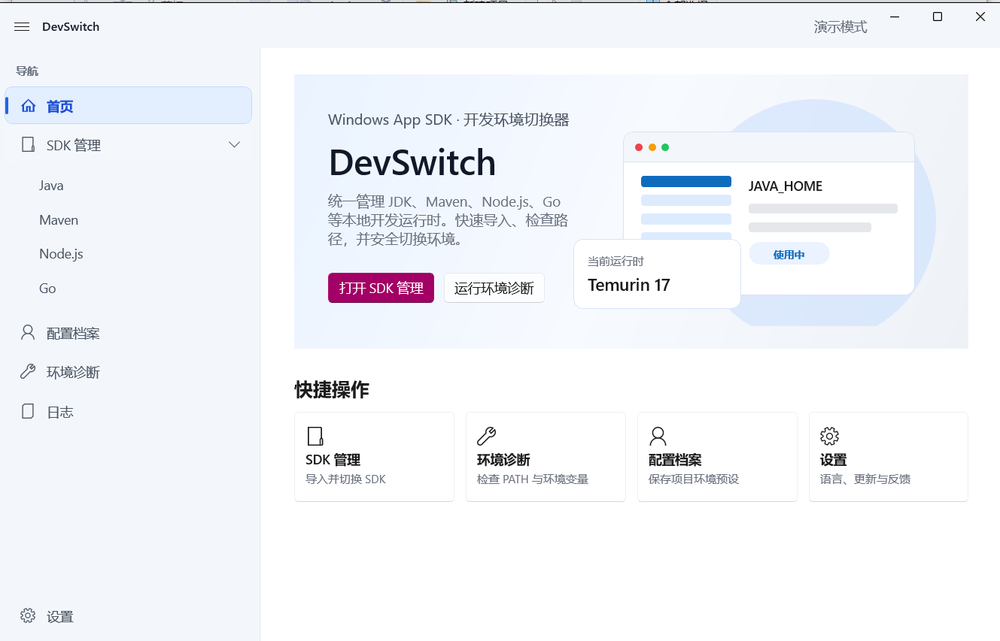

<div align="center">

# 🎛️ DevSwitch

**Windows 下统一管理 JDK、Maven、Node.js、Go 等开发运行时，一键切换、秒级生效、零卡顿。**

[](https://github.com/gongzhujiejie/devswitch)
[](https://dotnet.microsoft.com/)
[](https://learn.microsoft.com/windows/apps/winui/)
[](https://github.com/gongzhujiejie/devswitch)
[](https://github.com/gongzhujiejie/devswitch/releases)
[](./LICENSE)
[](https://github.com/gongzhujiejie/devswitch/releases)



</div>

---

## 📖 简介

**DevSwitch** 是一款面向 Windows 开发者的本地运行时版本管理工具。

在同一台机器上同时维护多个 JDK、Maven、Node.js、Go 版本是开发者的日常痛点：手动改 `PATH`、`JAVA_HOME` 容易出错，系统 `PATH` 还会撞上 2047 字符上限，旧版本残留还会"遮蔽"你想用的版本。DevSwitch 用 **shim 单目录 + junction 软链接** 的现代方案彻底解决这些问题——**切换只换一个软链接指向，环境变量与 PATH 全程不动**，因此又快又稳，不弹窗、不卡顿。它还能从官方源下载 SDK、保存项目级配置档案、诊断环境冲突、查看脱敏日志、热切换界面语言，并支持从 GitHub 一键自更新。

---

## 📑 目录

- [✨ 核心特性](#-核心特性)
- [🧱 技术栈](#-技术栈)
- [💻 安装要求](#-安装要求)
- [🚀 快速开始](#-快速开始)
- [🛠️ 使用示例](#️-使用示例)
- [⚙️ 配置说明](#️-配置说明)
- [🔄 自动更新](#-自动更新)
- [📝 更新日志](#-更新日志)
- [❓ 常见问题（FAQ）](#-常见问题faq)
- [🗺️ Roadmap](#️-roadmap)
- [🤝 贡献指南](#-贡献指南)
- [📜 许可证](#-许可证)
- [👤 作者与维护者](#-作者与维护者)
- [🙏 致谢](#-致谢)
- [🖼️ 截图替换说明](#️-截图替换说明)

---

## ✨ 核心特性

- **⚡ 一键切换运行时** —— Java / Maven / Node.js / Go 版本秒级切换，只更新 `current` 软链接指向，不重写环境变量，切换流畅无卡顿。
- **🧩 shim 单目录 PATH** —— 系统 `PATH` 只占一个 `shims` 目录即可覆盖所有命令，根治 2047 字符上限，并压过系统里残留的旧 SDK。
- **📥 从官方源下载 SDK** —— Java 覆盖 Adoptium Temurin 主流大版本（LTS 8/11/17/21/25 + 最新特性版），Maven / Node.js / Go 均取自各自官方源。
- **🗂️ 配置档案** —— 为不同项目保存一组 SDK 组合，一键应用切换。
- **🩺 环境诊断（Doctor）** —— 检查 `current` 链接完整性、HKCU/系统 PATH 冲突、命令解析版本、helper 可用性等，给出可操作建议。
- **📜 日志查看** —— 异步读取并自动脱敏（打码 token/密码、压缩 PATH），支持按通道过滤、刷新与清理过期日志。
- **🌐 界面语言热切换** —— 简体中文 / English / 跟随系统，切换即时生效，无需重启。
- **🔁 GitHub 自更新** —— 配置仓库后可一键下载新版并自动覆盖重启，全程保护用户数据目录。
- **📂 灵活的数据目录** —— 支持便携（随应用目录）/ 固定 C 盘 / 自定义路径三种模式，并可带进度地迁移现有数据。

---

## 🧱 技术栈

| 层 | 技术 |
| --- | --- |
| 桌面 UI | **WinUI 3**（Windows App SDK 1.5） |
| 应用 / 业务 | **C# 12 / .NET 8** |
| 特权与原生操作 | **C++20（MinGW）** —— `Helper`（junction/环境写入）、`Shim`（命令转发器）、`Updater`（自更新覆盖器） |
| 持久化 | `System.Text.Json`（`sdks.json` / `settings.json` / `profiles.json`） |
| 测试 | **xUnit**（500+ 单元/集成测试） |

> DevSwitch 的安全边界设计：所有需要写 junction、HKCU/HKLM 环境变量、覆盖安装目录的特权操作，都由独立的 C++ 小程序在受控边界内执行，主程序绝不直接改注册表或自我覆盖。

---

## 💻 安装要求

| 项 | 要求 |
| --- | --- |
| 操作系统 | Windows 10 1809+ / Windows 11 |
| 架构 | x64 |
| 运行时 | 自包含部署，**无需预装 .NET**（Windows App SDK runtime 已随包自包含） |
| 权限 | 日常切换无需管理员；首次把 `shims` 写入系统 PATH 时会触发一次 UAC |
| 网络 | 仅在「下载 SDK」「检查更新」时联网 |

---

## 🚀 快速开始

DevSwitch 是绿色免安装应用，下载解压即用。

```bash
# 1. 从 Releases 下载最新 Windows 包
#    https://github.com/gongzhujiejie/devswitch/releases

# 2. 解压到任意目录（建议非系统盘，便于便携模式）
#    例如 D:\Tools\DevSwitch

# 3. 双击运行
DevSwitch.App.exe
```

首次启动后，建议按以下顺序上手：

1. 进入 **SDK 管理 → Java**，点「**添加本地 SDK**」导入你机器上已有的 JDK 目录；或点「**下载**」从官方源拉取新版本。
2. 对想用的版本点「**切换**」，首次会弹一次 UAC（把 `shims` 目录写入系统 PATH）。
3. **重新打开终端**，执行 `java -version` 即为切换后的版本。

---

## 🛠️ 使用示例

### 场景 1：在多个 JDK 之间秒切

> 已导入 Java 8 / 17 / 21，想把当前 Java 从 17 切到 21。

操作：`SDK 管理 → Java →` 选中 `Temurin 21` 行 → 点「**切换**」。

切换后在**新开的终端**验证：

```bash
java -version
# openjdk version "21.0.x" ...

# Maven 会自动使用切换后的 JAVA_HOME
mvn -v
```

> 💡 原理：DevSwitch 只把 `current\java` 这个 junction 重新指向 Temurin 21，`JAVA_HOME` 与 `PATH` 的值从不变化，所以切换瞬间完成、不卡顿。

### 场景 2：从官方源下载并安装新版本

> 想安装一个官方 Temurin 21 而本机没有。

操作：`SDK 管理 → Java →` 点「**下载**」→ 在下拉中选择版本（覆盖 8 ~ 最新）→ 下载完成后自动登记，再点「切换」即可。

```text
下载 SDK
  SDK 类型：Java
  版本：    Temurin 21.0.x+x.LTS (x64)   ← 全部来自 api.adoptium.net 官方
```

### 场景 3：保存项目级配置档案

> 项目 A 用 Java 17 + Maven 3.9，项目 B 用 Java 21 + Node 20。

操作：`配置档案 →` 点「**新建档案**」分别保存两套组合，切项目时一键「**应用**」。

### 场景 4：诊断"切换不生效"

> 切换后终端仍是旧版本。

操作：进入 **环境诊断**，查看 `PATH 前序冲突` 检查项。它会指出是哪条**系统 PATH** 旧 JDK 在遮蔽，并给出清理建议。

---

## ⚙️ 配置说明

DevSwitch 的所有数据都存放在**数据目录**下，结构如下：

```text
<数据目录>/
├── config/
│   ├── sdks.json        # 已登记的 SDK 目录与当前活跃版本
│   ├── settings.json    # 应用设置（语言、下载并发、更新仓库、数据位置等）
│   └── profiles.json    # 配置档案
├── current/             # 各类型 current 软链接（junction）：java / maven / node / go
├── shims/               # 命令转发器（java.exe / mvn.exe / node.exe / go.exe ...）
├── sdks/                # 下载/托管的 SDK 实体
└── logs/                # 运行日志（已脱敏）
```

**数据位置模式**（`设置 → 数据目录`）：

| 模式 | 说明 |
| --- | --- |
| 便携 | 数据随应用目录走，适合放 U 盘 / 移动 |
| 固定到 C 盘 | 数据存 `%LOCALAPPDATA%\DevSwitch`，移动应用不影响数据与环境 |
| 自定义 | 指定任意目录，可带进度迁移现有数据 |

**关键环境变量**（由 DevSwitch 写入并管理）：

| 变量 | 含义 |
| --- | --- |
| `DEVSWITCH_HOME` | 数据根目录 |
| `JAVA_HOME` / `MAVEN_HOME` / `GOROOT` | 指向 `current/<type>`，跟随切换自动生效 |
| 系统 `PATH` | 仅追加一条 `<数据目录>\shims`，覆盖所有命令 |

> ⚠️ DevSwitch 的自更新与重置**绝不触碰 `data` 用户数据目录**（SDK、配置、日志）。

---

## 🔄 自动更新

DevSwitch 支持从 GitHub 仓库一键自更新（下载 → 校验 → 覆盖 → 重启）。

**配置步骤：**

1. 在 `设置 → 更新 → GitHub 仓库` 填写你的发布仓库：

   ```text
   gongzhujiejie/devswitch
   ```

2. 在该仓库发布 Release，要求：
   - **Tag** 用版本号且高于当前版本（如当前 `v0.1.0`，发布 `v0.2.0`）。
   - 上传 Windows 安装包 zip，文件名含 `win` 与 `x64`、以 `.zip` 结尾，例如 `DevSwitch-win10-x64.zip`。
   - （推荐）附带同名 `.sha256` 校验文件以校验完整性。

   > 💡 本仓库已配置 **GitHub Actions 自动发布**（见 `.github/workflows/release.yml`）：
   > 只需把 `src/DevSwitch.App/DevSwitch.App.csproj` 里的 `<Version>` 改成新版本号，
   > 提交后推送一个 `vX.Y.Z` tag，CI 会自动在 Windows runner 上构建、打包并发布 Release，
   > 同时附带 `DevSwitch-win10-x64.zip` 与 `.sha256`，无需手动打包。

   如需手动生成校验文件：

   ```powershell
   (Get-FileHash DevSwitch-win10-x64.zip -Algorithm SHA256).Hash.ToLower() `
     | Out-File DevSwitch-win10-x64.zip.sha256 -Encoding ascii -NoNewline
   ```

3. 在 DevSwitch 中点「**检查更新**」→「**下载并更新**」，应用会自动完成升级并重启。

> 自更新由独立的 `DevSwitch.Updater.exe` 在主程序退出后执行覆盖，安装目录位于受保护位置时会按需提权。

---

## 📝 更新日志

完整版本历史见 [CHANGELOG.md](./CHANGELOG.md)。最新稳定版本为 **v0.2.5**。

---

## ❓ 常见问题（FAQ）

**Q1：切换后 `java -version` 还是旧版本？**
A：先**关闭所有已打开的终端再重开**（Windows 旧进程不会刷新环境）。若仍是旧版，去 `环境诊断` 看「PATH 前序冲突」，按提示清理**系统 PATH** 里残留的旧 JDK 条目。

**Q2：为什么切换某些操作会弹 UAC？**
A：把 `shims` 目录首次写入**系统 PATH（HKLM）** 需要管理员权限，这是 Windows 的硬性要求。写好后日常切换不再弹窗。

**Q3：自更新会不会覆盖我的 SDK 和配置？**
A：不会。更新器只覆盖安装目录的程序文件，**完全跳过 `data` 用户数据目录**，并且只增量覆盖、不删除你额外放入的文件。

**Q4：下载的 SDK 是从哪里来的？是官方的吗？**
A：是官方源。Java 来自 Adoptium Temurin（`api.adoptium.net`），Maven / Node.js / Go 均取自各自官方发布地址。

**Q5：能放 U 盘随身携带吗？**
A：可以。在 `设置 → 数据目录` 选「便携」模式，数据随应用目录走；DevSwitch 启动时会自动校正目录漂移。

**Q6：界面能切换成英文吗？需要重启吗？**
A：`设置 → 界面语言` 选 English 即可，**即时生效无需重启**。

---

## 🗺️ Roadmap

- [ ] 将剩余页面文本全量接入本地化（当前导航与设置页已支持热切换）
- [ ] 配置档案「应用」直接联动切换服务，一键切齐整套运行时
- [ ] SDK 总览卡片按类型显示专属图标
- [ ] 私有仓库自更新（GitHub Token 支持）
- [ ] 更多发行版支持（Zulu / Corretto / GraalVM 等）
- [ ] 深色模式

> 欢迎在 [Issues](https://github.com/gongzhujiejie/devswitch/issues) 中提出你的需求与建议。

---

## 🤝 贡献指南

非常欢迎任何形式的贡献！🎉

1. **Fork** 本仓库并创建特性分支：`git checkout -b feature/your-feature`
2. 提交改动：`git commit -m "feat: 添加了某某功能"`（建议遵循 [Conventional Commits](https://www.conventionalcommits.org/)）
3. 推送分支：`git push origin feature/your-feature`
4. 发起 **Pull Request**，并清晰描述你的改动与动机

**开发约定：**

- 业务逻辑优先写在 `DevSwitch.Core` 并配 xUnit 测试（测试外部行为，不测实现细节）
- 提交前请确保全量测试通过
- 代码保持中文注释，关键逻辑说明"为什么这么写"

> 提交 Bug 时，请附上复现步骤、`环境诊断` 截图与（脱敏后的）日志，便于快速定位。

---

## 📜 许可证

本项目基于 [MIT License](./LICENSE) 开源。

> 若你希望使用其他许可证（如 GPL-3.0），可在仓库 `Add license` 中调整并替换本节徽章。

---

## 👤 作者与维护者

- **gongzhujiejie** · [GitHub](https://github.com/gongzhujiejie)

---

## 🙏 致谢

- [Eclipse Adoptium / Temurin](https://adoptium.net/) —— 官方 JDK 发行版与版本 API
- [Microsoft WinUI / Windows App SDK](https://learn.microsoft.com/windows/apps/winui/) —— 现代 Windows 桌面 UI
- [Node.js](https://nodejs.org/) · [Apache Maven](https://maven.apache.org/) · [Go](https://go.dev/) —— 官方发布源
- 所有提交 Issue 与 PR 的贡献者 ❤️

---

## 🖼️ 截图替换说明

本 README 中的图片为占位路径，请按以下步骤替换为你的真实截图：

1. 在仓库根目录创建 `images/` 文件夹。
2. 放入对应截图并使用以下文件名（或自行修改 README 中的引用路径）：

   | 占位路径 | 建议内容 |
   | --- | --- |
   | `./images/home.png` | 应用首页 |
   | `./images/sdk.png` | SDK 管理页 |
   | `./images/profiles.png` | 配置档案页 |
   | `./images/doctor.png` | 环境诊断页 |
   | `./images/settings.png` | 设置 / 更新页 |

3. 提交并推送，GitHub 即会自动渲染图片。

> 如需添加更多展示，在文中按 `` 格式插入即可。
